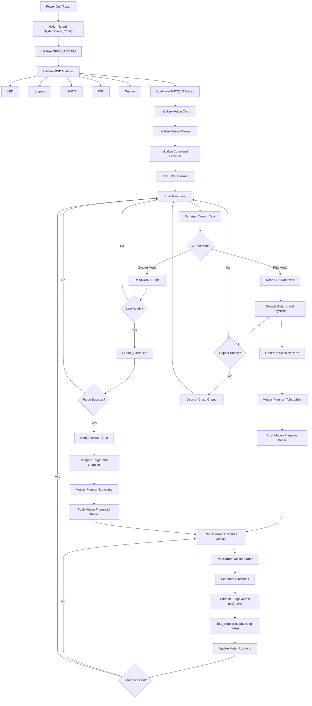

# Project Flowchart

```mermaid
flowchart TD
    A[Power On / Reset] --> B[HAL_Init and SystemClock_Config]
    B --> C[Initialize GPIO UART TIM]
    C --> D[Initialize BSP Modules]
    D --> D1[LED]
    D --> D2[Stepper]
    D --> D3[UART1]
    D --> D4[PS2]
    D --> D5[Gripper]
    D --> E[Configure TMC2209 Nodes]
    E --> F[Initialize Motion Core]
    F --> G[Initialize Motion Planner]
    G --> H[Initialize Command Executor]
    H --> I[Start TIM6 Interrupt]
    I --> J[Enter Main Loop]

    J --> K[Run App_Teleop_Task]
    K --> L{Current Mode}

    L -->|PS2 Mode| M[Read PS2 Controller]
    M --> N[Decode Buttons and Joysticks]
    N --> O[Generate Small dx dy dz]
    O --> P[Motion_Planner_TeleopStep]
    P --> Q[Push Motion Frame to Buffer]
    Q --> R[TIM6 Interrupt Executes Motion]

    L -->|G-code Mode| S[Read UART1 Line]
    S --> T{Line Ready?}
    T -->|No| J
    T -->|Yes| U[GCode_ParseLine]
    U --> V{Parse Success?}
    V -->|No| J
    V -->|Yes| W[Cmd_Executor_Run]
    W --> X[Compute Target and Duration]
    X --> Y[Motion_Planner_MoveLine]
    Y --> Z[Push Motion Frames to Buffer]
    Z --> R

    R --> AA[Pop Current Motion Frame]
    AA --> AB[Set Motor Directions]
    AB --> AC[Distribute Steps Across total_ticks]
    AC --> AD[bsp_stepper outputs step pulses]
    AD --> AE[Update Motor Positions]
    AE --> AF{Frame Finished?}
    AF -->|No| R
    AF -->|Yes| J

    N --> AG{Gripper Button?}
    AG -->|Yes| AH[Open or Close Gripper]
    AG -->|No| J
    AH --> J
```
