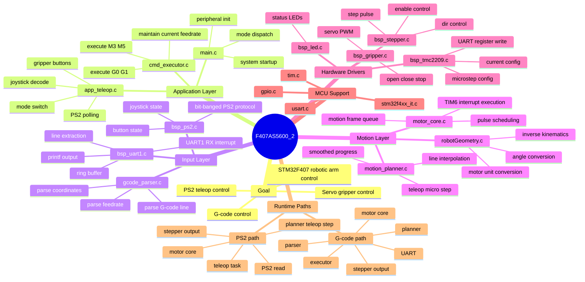

# Project Mindmap

```mermaid
mindmap
  root((F407AS5600_2))
    Goal
      STM32F407 robotic arm control
      G-code control
      PS2 teleop control
      Servo gripper control
    Application Layer
      main.c
        system startup
        mode dispatch
        peripheral init
      app_teleop.c
        PS2 polling
        joystick decode
        mode switch
        gripper buttons
      cmd_executor.c
        execute G0 G1
        execute M3 M5
        maintain current feedrate
    Input Layer
      bsp_uart1.c
        UART1 RX interrupt
        ring buffer
        line extraction
        printf output
      gcode_parser.c
        parse G-code line
        parse coordinates
        parse feedrate
      bsp_ps2.c
        bit-banged PS2 protocol
        button state
        joystick state
    Motion Layer
      motion_planner.c
        line interpolation
        smoothed progress
        teleop micro step
      robotGeometry.c
        inverse kinematics
        angle conversion
        motor unit conversion
      motor_core.c
        motion frame queue
        TIM6 interrupt execution
        pulse scheduling
    Hardware Drivers
      bsp_stepper.c
        step pulse
        dir control
        enable control
      bsp_tmc2209.c
        UART register write
        microstep config
        current config
      bsp_gripper.c
        servo PWM
        open close stop
      bsp_led.c
        status LEDs
    MCU Support
      gpio.c
      tim.c
      usart.c
      stm32f4xx_it.c
    Runtime Paths
      G-code path
        UART
        parser
        executor
        planner
        motor core
        stepper output
      PS2 path
        PS2 read
        teleop task
        planner teleop step
        motor core
        stepper output
```
